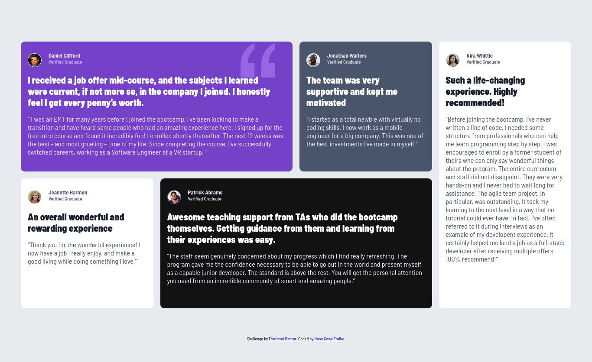
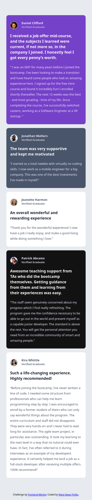

# Frontend Mentor - Testimonials grid section solution

This is a solution to the [Testimonials grid section challenge on Frontend Mentor](https://www.frontendmentor.io/challenges/testimonials-grid-section-Nnw6J7Un7). Frontend Mentor challenges help you improve your coding skills by building realistic projects.

## Overview

This project is a solution to the Testimonials grid section challenge from Frontend Mentor. The goal was to create a responsive testimonials section using semantic HTML and modern CSS. The component displays five testimonial cards, each with a user image, name, status, testimonial, and quote, arranged responsively for both mobile and desktop layouts.

The project focuses on semantic HTML structure, responsive design using Flexbox and CSS Grid, and custom styling with CSS variables and custom fonts. The page is fully responsive and adapts well to different screen sizes, making it suitable for both desktop and mobile devices.

### Screenshot




### Links

- Solution URL: [https://github.com/nana-kwao/testimonials-grid-challenge](https://github.com/nana-kwao/testimonials-grid-challenge)
- Live Site URL: [https://nana-kwao.github.io/testimonials-grid-challenge](https://nana-kwao.github.io/testimonials-grid-challenge)

## Built with

- Semantic HTML5 markup
- CSS custom properties
- Flexbox
- CSS Grid
- Mobile-first workflow

## What I learned

While working on this project, I strengthened my understanding of semantic HTML and responsive design using both Flexbox and CSS Grid. I learned how to structure a testimonials section with clear, accessible markup, use custom fonts for improved aesthetics, and apply CSS variables for consistent theming. I also practiced making the layout adapt well to different screen sizes and using CSS Grid for complex desktop layouts.

Here are some code snippets that highlight what I learned:

```html
<main>
  <section>
    <header>
      
      <section>
        <h2>Daniel Clifford</h2>
        <h3>Verified Graduate</h3>
      </section>
      
    </header>
    <p class="para">I received a job offer mid-course, and the subjects I learned were current, if not more so, in the company I joined. I honestly feel I got every penny’s worth.</p>
    <q>I was an EMT for many years before I joined the bootcamp...</q>
  </section>
  <!-- ...other sections... -->
</main>
```

```css
main {
  width: 100%;
  display: flex;
  flex-direction: column;
  align-items: center;
  margin: 0 auto;
}
@media screen and (min-width: 80rem) {
  main {
    display: grid;
    grid-template-columns: repeat(4, 1fr);
    grid-template-rows: repeat(2, 1fr);
    gap: 1rem;
  }
}
```

## Author

- Frontend Mentor - [@nana-kwao](https://www.frontendmentor.io/profile/nana-kwao)
- Twitter - [@f_nanakwao](https://www.twitter.com/f_nanakwao)

## Acknowledgments

Thanks to the Frontend Mentor community for inspiration and assistance. Special thanks to those who provided feedback.
